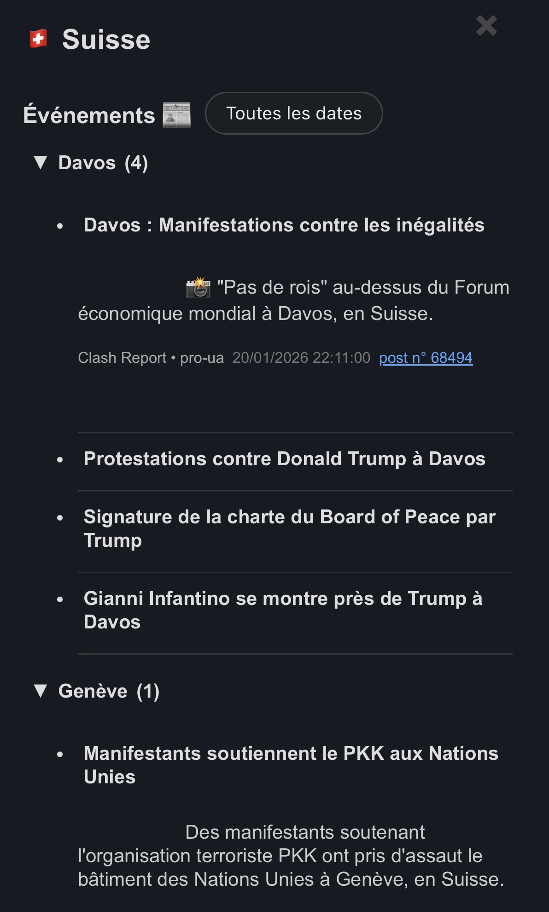

# 🛰️ OpenAtlas Online

Pipeline OSINT qui collecte des événements depuis des canaux Telegram, les traduit, les enrichit (géolocalisation / métadonnées), puis génère un site statique avec JSON pour l’affichage sur un planisphère interactif.
Le pipeline tourne via GitHub Actions (secrets via GitHub Secrets) et le site est déployé sur Netlify.

<div style="display:flex; gap:12px; align-items:flex-start;">
    
    
</div>

---

## 🎯 Fonctionnalités principales

- **Collecte Telegram** : Récupère les messages des canaux Telegram sur 24h.
- **Déduplication** : Nettoie les doublons pour une base de données propre.
- **Traduction & enrichissement** : Utilise l'API OpenAI pour traduire et extraire des informations clés (pays, région, titre, etc.).
- **Stockage** : Sauvegarde dans une base SQLite ou Neon (PostgreSQL).
- **Génération JSON** : Exporte des fichiers JSON statiques pour le front.
- **Dashboard web** : Visualisation interactive des événements sur une carte (Leaflet.js), sans backend runtime.

---

## 🏗️ Structure du projet

- `app/` : Modèles, accès DB, services de collecte/enrichissement
- `tools/` : Scripts CLI (init Telegram, pipeline, build statique)
- `static/` : Fichiers statiques (JS, CSS, données pays)
- `templates/` : Template HTML du dashboard
- `data/` : Base SQLite locale (optionnelle)
- `site/` : Build statique (généré, non versionné)

---

## 💾 Installation

1. Créez un environnement virtuel Python 3.10+ :
   ```bash
   python3 -m venv .venv
   source .venv/bin/activate
   pip install -r requirements.txt
   ```
2. Copiez `.env.example` en `.env` et renseignez vos clés Telegram & OpenAI (et `DB_URL` si Neon).

---

## 🚀 Lancement

- **Initialisation session Telegram** :
   ```bash
   python tools/init_telegram.py
   ```
- **Pipeline Telegram → DB** :
   ```bash
   python tools/run_pipeline.py
   ```
- **Build statique** :
   ```bash
   python tools/build_static_site.py
   ```
- **Prévisualisation locale** :
   ```bash
   python -m http.server --directory site 8000
   ```
- **Export CSV** :
   ```bash
   python tools/export_messages.py
   ```

---

## ⚙️ Configuration

Voir `.env.example` pour les variables nécessaires :
- Clés Telegram & OpenAI
- SOURCES_TELEGRAM : liste des canaux à surveiller
- Model OpenAI
- Nombre max msg/jours
- Batch size

---

## 🌐 Déploiement Netlify (sans commit des JSON)

1. Créez un site Netlify via drag & drop du dossier `site/` (une seule fois).
2. Récupérez `NETLIFY_SITE_ID` et créez un `NETLIFY_AUTH_TOKEN`.
3. Ajoutez ces secrets dans GitHub Actions.
4. Lancez le workflow “Daily pipeline”.

---

## 📄 Licence

Projet open-source, usage libre.
